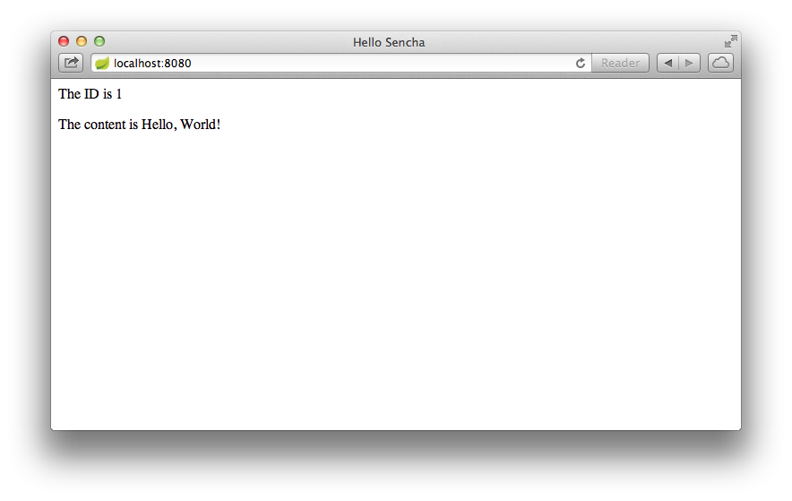

:spring_boot_version: 1.2.2.RELEASE
:gs-rest-service-cors: link:/guides/gs/rest-service-cors/
:gs-spring-boot: link:/guides/gs/spring-boot/
:toc:
:icons: font
:source-highlighter: prettify
:project_id: gs-consuming-rest-restjs
This guide walks you through the process of consuming a simple Sencha Touch
client that consumes a Spring MVC-based link:/understanding/REST[RESTful web service].

== What you'll build

You will build a Sencha Touch client that consumes a Spring-based RESTful
web service. Specifically, the client will consume the service created in
{gs-rest-service-cors}[Building a RESTful Web Service with CORS].

The Sencha Touch client will be accessed by opening the `index.html` file in
your browser, and will consume the service accepting requests at:

    http://rest-service.guides.spring.io/greeting

The service will respond with a link:/understanding/JSON[JSON] representation of a greeting:

[source,json]
----
{"id":1,"content":"Hello, World!"}
----

The client will render the ID and content into the DOM.

You can customize the greeting with an optional *query string* in the url:

    http://localhost:8080/?User

The code will send a parameter to the REST endpoint and
render a custom greeting into the DOM.

== What you'll need

 - About 15 minutes
 - A favorite text editor
 - A modern web browser (mobile or desktop)
 - An internet connection

[[scratch]]
[[initial]]
== Create an Ext model

First, create an Ext model named `GreetingModel`.  Place this model
in the `app/model` directory.  This is the default location for
Sencha models and will allow Sencha's loader to find it.

`public/app/model/GreetingModel.js`
[source,js]
----
include::complete/public/app/model/GreetingModel.js[]
----

`GreetingModel` extends `Ext.data.Model` and defines two fields:
'id' and 'content'.

== Create a view

Sencha's `Ext.Panel` can be used as a simple view.  This file
should also be placed in Sencha's default location for views:

`public/app/view/GreetingView.js`
[source,js]
----
include::complete/public/app/view/GreetingView.js[]
----

The contents of the view are defined by the template described in
the `tpl` config option.  The tokens delineated by the curly braces
in the template (e.g. `{id}`), will be replaced by the model fields
when the view is rendered.

== Create an Ext store

Next, create an Ext store that will load the model.

`public/app/store/GreetingStore.js`
[source,js]
----
include::complete/public/app/store/GreetingStore.js[]
----

The store extends `Ext.data.Store` and references our `GreetingModel`
model. To instruct the store to use the REST proxy,
we configure it with a proxy definition object with `type:"rest"` and
then point it at our REST endpoint url.

To customize the greeting, create a `beforeload` listener that sets
an extra parameter on the proxy's url.

== Create an Ext application

Next, create an `Ext.app.Application` object using Sencha's `Ext.application`
shortcut function:

`public/hello.js`
[source,js]
----
include::complete/public/hello.js[]
----

The application object automatically resolves the location of the models,
views, and stores if you follow Sencha's default directory conventions.
You must assign the application a namespace by providing the `name`
parameter.  You must also specify the model, view, and store in the
`models`, `views`, and `stores` arrays so that Sencha's loader can
find and fetch those files.

Add a `launch` callback. This is where the application will be composed after
all of the files have loaded.  Inside this callback, create an instance
of the view and an instance of the store.  Configure the store to
autoload so it will immediately fetch the model at the endpoint url.

Add a load listener to move the fetched data into the view.  Ext automatically
wraps the data in an array, but the view only needs the first record.

For easier debugging, enable caching by setting the Ext Loader's
`disableCaching` option to `false`.

== Create the application page

Finally, create an `index.html` file and add the following HTML:

`public/index.html`
[source,html]
----
include::complete/public/index.html[]
----

The first `script` element loads Sencha Touch from Sencha's CDN.  The second
script loads the application object.

[[run]]
== Run the client

To run the client, you'll need to serve it from a web server to your browser. The Spring Boot CLI (Command Line Interface) includes an embedded Tomcat server, which offers a simple approach to serving web content. See {gs-spring-boot}[Building an Application with Spring Boot] for more information about installing and using the CLI.

In order to serve static content from Spring Boot's embedded Tomcat server, you'll also need to create a minimal amount of web application code so that Spring Boot knows to start Tomcat. The following `app.groovy` script is sufficient for letting Spring Boot know that you want to run Tomcat:

`app.groovy`
[source,groovy]
----
include::complete/app.groovy[]
----

You can now run the app using the Spring Boot CLI:

----
spring run app.groovy
----

Once the app starts, open http://localhost:8080 in your browser, where you see:

The ID value will increment each time you refresh the page.

== Summary

Congratulations! You've just developed a Sencha client that consumes a
Spring-based RESTful web service.
